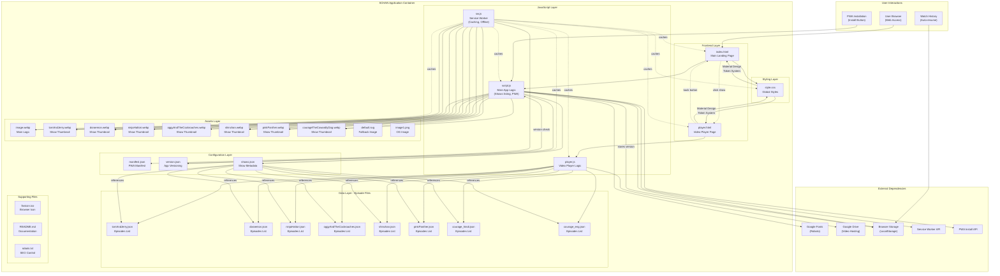

# SCHANS Project Architecture

```mermaid
graph TB
    subgraph "SCHAN Application Container"
        subgraph "Frontend Layer"
            FE1["index.html<br/>Main Landing Page"]
            FE2["player.html<br/>Video Player Page"]
        end
        
        subgraph "JavaScript Layer"
            JS1["script.js<br/>Main App Logic<br/>(Shows listing, PWA)"]
            JS2["player.js<br/>Video Player Logic"]
            JS3["sw.js<br/>Service Worker<br/>(Caching, Offline)"]
        end
        
        subgraph "Configuration Layer"
            CF1["manifest.json<br/>PWA Manifest"]
            CF2["version.json<br/>App Versioning"]
            CF3["shows.json<br/>Show Metadata"]
        end
        
        subgraph "Data Layer - Episode Files"
            DF1["tomAndJerry.json<br/>Episodes List"]
            DF2["doraemon.json<br/>Episodes List"]
            DF3["ninjaHattori.json<br/>Episodes List"]
            DF4["oggyAndTheCockroaches.json<br/>Episodes List"]
            DF5["shinchan.json<br/>Episodes List"]
            DF6["pinkPanther.json<br/>Episodes List"]
            DF7["courage_hindi.json<br/>Episodes List"]
            DF8["courage_eng.json<br/>Episodes List"]
        end
        
        subgraph "Assets Layer"
            AS1["image.webp<br/>Main Logo"]
            AS2["tomAndJerry.webp<br/>Show Thumbnail"]
            AS3["doraemon.webp<br/>Show Thumbnail"]
            AS4["ninjaHattori.webp<br/>Show Thumbnail"]
            AS5["oggyAndTheCockroaches.webp<br/>Show Thumbnail"]
            AS6["shinchan.webp<br/>Show Thumbnail"]
            AS7["pinkPanther.webp<br/>Show Thumbnail"]
            AS8["courageTheCowardlyDog.webp<br/>Show Thumbnail"]
            AS9["default.svg<br/>Fallback Image"]
            AS10["image1.png<br/>OG Image"]
        end
        
        subgraph "Styling Layer"
            ST1["style.css<br/>Global Styles"]
        end
        
        subgraph "Supporting Files"
            SF1["favicon.ico<br/>Browser Icon"]
            SF2["README.md<br/>Documentation"]
            SF3["robots.txt<br/>SEO Control"]
        end
    end
    
    subgraph "External Dependencies"
        ED1["Google Fonts<br/>(Roboto)"]
        ED2["Google Drive<br/>(Video Hosting)"]
        ED3["Browser Storage<br/>(LocalStorage)"]
        ED4["Service Worker API"]
        ED5["PWA Install API"]
    end
    
    subgraph "User Interactions"
        UI1["User Browser<br/>(Web Access)"]
        UI2["PWA Installation<br/>(Install Button)"]
        UI3["Watch History<br/>(Auto-resume)"]
    end
    
    %% Data Flow Relationships
    FE1 --> JS1
    FE2 --> JS2
    JS1 --> CF3
    JS1 --> CF2
    JS2 --> DF1
    JS2 --> DF2
    JS2 --> DF3
    JS2 --> DF4
    JS2 --> DF5
    JS2 --> DF6
    JS2 --> DF7
    JS2 --> DF8
    JS1 --> AS2
    JS1 --> AS3
    JS1 --> AS4
    JS1 --> AS5
    JS1 --> AS6
    JS1 --> AS7
    JS1 --> AS8
    FE1 --> ST1
    FE2 --> ST1
    JS3 --> CF1
    JS3 --> AS1
    JS3 --> AS2
    JS3 --> AS3
    JS3 --> AS4
    JS3 --> AS5
    JS3 --> AS6
    JS3 --> AS7
    JS3 --> AS8
    JS1 --> ED1
    JS2 --> ED2
    JS1 --> ED3
    JS1 --> ED4
    JS1 --> ED5
    UI1 --> FE1
    UI2 --> JS1
    UI3 --> ED3
    
    %% Navigation Flow
    FE1 -.->|"click show"| FE2
    FE2 -.->|"back button"| FE1
    
    %% Service Worker Caching
    JS3 -.->|"caches"| FE1
    JS3 -.->|"caches"| FE2
    JS3 -.->|"caches"| JS1
    JS3 -.->|"caches"| JS2
    JS3 -.->|"caches"| ST1
    JS3 -.->|"caches"| CF3
    JS3 -.->|"caches"| AS1
    
    %% Style and Theme
    ST1 -->|"Material Design<br/>Token System"| FE1
    ST1 -->|"Material Design<br/>Token System"| FE2
    
    %% Version Management
    CF2 -->|"version check"| JS1
    JS1 -->|"stores version"| ED3
    
    %% Episode Loading Flow
    CF3 -->|"references"| DF1
    CF3 -->|"references"| DF2
    CF3 -->|"references"| DF3
    CF3 -->|"references"| DF4
    CF3 -->|"references"| DF5
    CF3 -->|"references"| DF6
    CF3 -->|"references"| DF7
    CF3 -->|"references"| DF8
```